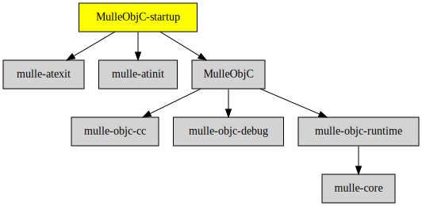

# MulleObjC-startup

#### ▶️  Startup code for MulleObjC

This static library provides the required `__register_mulle_objc_universe`
function for executables, that link against
[MulleObjC](//github.com/mulle-objc/MulleObjC).
It also bequeaths the required dependencies
[mulle-atinit](//github.com/mulle-core/mulle-atinit) and
[mulle-atexit](//github.com/mulle-core/mulle-atexit) for linking.

Use this library, if you want to create executables, that only
require the [MulleObjC](//github.com/mulle-objc/MulleObjC)
and nothing else. Often projects will link against the
[Foundation](//github.com/MulleFoundation/Foundation) though, and will use
its startup library.


| Release Version                                       | Release Notes
|-------------------------------------------------------|--------------
|  [](//github.com/mulle-objc/MulleObjC-startup/actions) | [RELEASENOTES](RELEASENOTES.md) |


### You are here




## Requirements

|   Requirement         | Release Version  | Description
|-----------------------|------------------|---------------
| [# MulleObjC muss no-bequeath sein, wegen dies und das](MulleObjC muss no-bequeath sein, wegen dies und das) | - | ▶️  Startup code for MulleObjC
| [MulleObjC](https://github.com/mulle-objc/MulleObjC) |  [](https://github.com///actions/workflows/mulle-sde-ci.yml) | 💎 A collection of Objective-C root classes for mulle-objc
| [mulle-atinit](https://github.com/mulle-core/mulle-atinit) |  [](https://github.com///actions/workflows/mulle-sde-ci.yml) | 🤱🏼 Compatibility library for deterministic initializers
| [mulle-atexit](https://github.com/mulle-core/mulle-atexit) |  [](https://github.com///actions/workflows/mulle-sde-ci.yml) | 👼 Compatibility library to fix atexit


## Add

### Add as an individual component

Use [mulle-sde](//github.com/mulle-sde) to add MulleObjC-startup to your project:

``` sh
mulle-sde add github:mulle-objc/MulleObjC-startup
```

To only add the sources of MulleObjC-startup with dependency
sources use [clib](https://github.com/clibs/clib):


``` sh
clib install --out src/mulle-objc mulle-objc/MulleObjC-startup
```

Add `-isystem src/mulle-objc` to your `CFLAGS` and compile all the sources that were downloaded with your project.


## Install

### Install with mulle-sde

Use [mulle-sde](//github.com/mulle-sde) to build and install MulleObjC-startup and all dependencies:

``` sh
mulle-sde install --prefix /usr/local \
   https://github.com///archive/latest.tar.gz
```

### Manual Installation

Install the [Requirements](#Requirements) and then
install **MulleObjC-startup** with [cmake](https://cmake.org):

``` sh
cmake -B build \
      -DCMAKE_INSTALL_PREFIX=/usr/local \
      -DCMAKE_PREFIX_PATH=/usr/local \
      -DCMAKE_BUILD_TYPE=Release &&
cmake --build build --config Release &&
cmake --install build --config Release
```


## Author

[Nat!](https://mulle-kybernetik.com/weblog) for Mulle kybernetiK  


